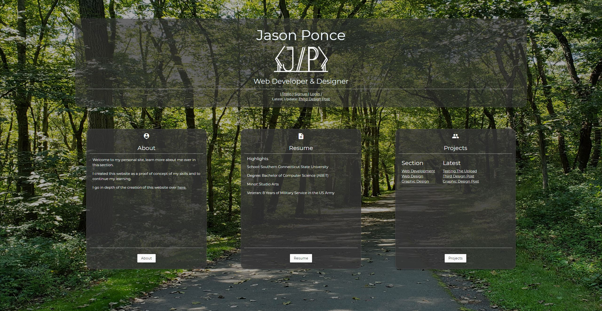
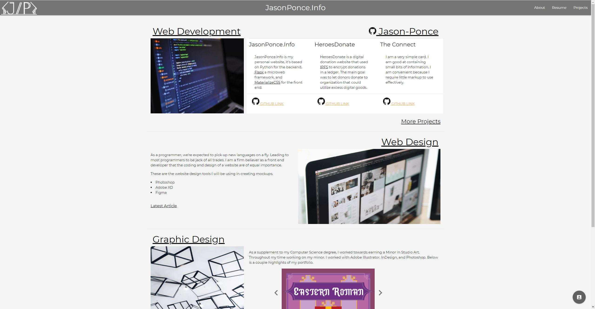

<h1>Portfolio Website</h>

Not so much quick and simple, but a culmination of knowledge from 2020 without the weight of being more than what its supposed to be.

>>>>

<h2> The Why </h2>

I'm still working on [personal-website](https://github.com/Jason-Ponce/personal-website) , which is the repo I'm using for my portfolio website [JasonPonce.Info](http://www.jasonponce.info/) from May 2020 to Dec 2020. Personal-website uses Python-Flask for the backend, SQLite for database and for the frontend an unholy union of MaterializeCSS, custom CSS, and terrible code. It is in dire need of a re-write and a new direction. Currently I'm focused on working on smaller projects to further expand my knowledge and skills. 

<h3> What’s Quick-Personal-Website? </h3>
<h4>Uses</h4>

The website won't be using any frontend frameworks such as Bootstrap, MaterializeCSS, Tailwind, ect. Just simple code and a beautiful website. 

* HTML5
* CSS
* JavaScript

<h2> Old Website Images</h2>

<h4>Homepage</h4>

<h4>Hub section</h4>

